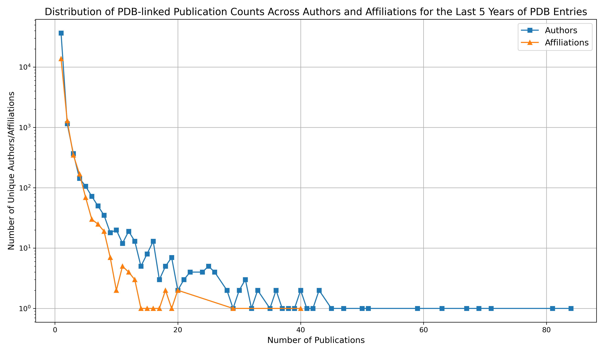

# PDB-EuropePMC Data Integration and Analysis Report

## 1. Introduction

**Objective:**  
To retrieve Protein Data Bank (PDB) entries from the last 5 years and link them to their associated journal articles in Europe PMC.  
This project explores trends in PDB-submission related publications and maps top publishing authors and institutes contributing to structural biology literature.

**Tools & Technologies Used:**  
- Programming: Python, Jupyter Notebooks  
- APIs: EBI Search API, Europe PMC RESTful Web Service (searchPOST)  
- Key Libraries: `requests`, `pandas`, `matplotlib`, `pyvis`

---

## 2. Data Retrieval

### 2.1 EBI Search API (PDB Database)
- **Base URL:** "https://www.ebi.ac.uk/ebisearch/ws/rest/pdbe"
- **Parameters:** 
- size: 100         #Fetched 100 entries per request. 
- format: json      #Retrieved response in json format
- filter: 2020-2025 #Filtered for entries in the last 5 years
- start: 0+=100     #Retreived entries in batches of 100
- query: "*:*"      #Retrieve all entries
- fields:           #Selected which metadata to obtain using API
    - id = unique protein identifier ID e.g. 7l5l
    - description = description of protein structure *e.g. FLUORESCENT PROTEIN x-ray diffraction entry at resolution 2.01*
    - PUBMED = ID for publication associated with protein *e.g. 34748541*
    - acc = another protein identifier, often identical to id *e.g. 7l5l*
    - domain_source = pdbe databse
    - name = name of protein structure *e.g. Crystal structure of the DiB-RM protein*
    - creation_date = date of entry *e.g. 20201222*

**Output:**
- Retrieved data for 59769 PDB entries for the past 5 years from 01/01/2020-23/07/2025.

**Challenges & Solutions:**
- Maximum 100 entries per API request as stated in EBI API documentation.
- Used the start parameter to iterate through the entries in batches of 100.
- Added 100 to the start parameter for each request until all entries were downloaded. 

### 2.2 Europe PMC API
- **Base URL:** "https://www.ebi.ac.uk/europepmc/webservices/rest/searchPOST"
- **Parameters:** 
- query: pmid       #Searched for all unique pmids associated with PDB entries
- format: json      #Retrieved response in json format
- resultType: core  #Got most comprehensive metadata search
- pageSize: 1000    #Maximum number of responses per request

**Preprocessing:**
- Extracted 19782 unique PMIDs from PDB entries for past 5 years.
- Queried Europe PMC API looping through these IDs

**Output:**
- Retrieved metadata for 19457 articles.
- Formatted the metadata as metadata.csv file with the most relevant features for analysis including:
    - Title  
    - Author list 
    - Affiliation 
    - Journal
    - Journal nlmid
    - Publication year
    - Open Access: Yes/No
    - Doi
    - Pmid
    - Abstract
    - Number of citations
- Also formatted this dataframe with a row for each individual author for downstream analysis. 

**Challenges & Solutions:**
- Maximum 1000 responses per API request as stated in EBI API documentation.
- Created a list of pmids and iterated through these in batches of 1000.

## 3. Data Analysis

### 3.1 Top Authors
- Analysis of top publishing authors across ePDB entries for the past 5 years. 

Top 10 Publishing Authors:
| Author Name & ORCID ID            |   Publication Count |
|:----------------------------------|--------------------:|
| Xu HE (0000-0002-6829-8144)       |                  78 |
| Baker D (0000-0001-7896-6217)     |                  73 |
| Knapp S (0000-0001-5995-6494)     |                  67 |
| Gao GF (0000-0002-3869-615X)      |                  67 |
| Ward AB (0000-0001-7153-3769)     |                  54 |
| Supuran CT (0000-0003-4262-0323)  |                  52 |
| Wilson IA (0000-0002-6469-2419)   |                  49 |
| Nureki O (0000-0003-1813-7008)    |                  46 |
| Rossjohn J (0000-0002-2020-7522)  |                  46 |
| McLellan JS (0000-0003-3991-542X) |                  46 |

[Pyvis Network of Top 200 Publishing Authors:](./output/figures/author_collab_network.html). Download this link and open in browser to view the network.
- Nodes are authors, edges are collaboration links
- Node size indicates number of publications, edge width indicates number of collaborative publications. 

**Challenges & Solutions:**
- 55.6% of authors were missing a valid ORCID, which meant individuals with the same name were being grouped together during analysis.
- Since there was no way to distinguish between these individuals, any author without a valid ID was removed from this analysis.

### 3.2 Top Affiliations
- Analysis of top publishing affiliates across ePDB entries for the past 5 years. 

Top 10 Publishing Affiliations:
| Affiliation                                                                                                                             | Publication Count |
|:----------------------------------------------------------------------------------------------------------------------------------------|------------------:|
| Department of Biochemistry, University of Washington, Seattle, WA, USA.                                                                 |                40 |
| MRC Laboratory of Molecular Biology, Cambridge, UK.                                                                                     |                29 |
| Department of Structural Biology, Van Andel Institute, Grand Rapids, MI, USA.                                                           |                20 |
| Department of Molecular and Cellular Physiology, Stanford University School of Medicine, Stanford, CA, USA.                             |                20 |
| Department of Biochemistry, University of Zurich, Zurich, Switzerland.                                                                  |                19 |
| Vaccine Research Center, National Institute of Allergy and Infectious Diseases, National Institutes of Health, Bethesda, MD 20892, USA. |                18 |
| Department of Biochemistry and Molecular Biophysics, Columbia University, New York, NY, USA.                                            |                18 |
| Department of Biochemistry, University of Washington, Seattle, WA 98195, USA.                                                           |                17 |
| Department of Integrative Structural and Computational Biology, The Scripps Research Institute, La Jolla, CA 92037, USA.                |                16 |
| Division of Biomedical Convergence, College of Biomedical Science, Kangwon National University, Chuncheon, 24341, Republic of Korea.    |                15 |

**Challenges & Solutions:**
- There was standardised ID to identiy the affiliation.
- Spelling errors, different formatting or different abbreviations aren't accounted for.
- Future improvements could find a method to normalise the affiliation labels.

### 3.3 PDB Entry and Associated Article Trends Over Time

- PDB entries per year from 2020–2025:

|   Year |   PDB Entry Count |
|-------:|------------------:|
|   2020 |             12013 |
|   2021 |             11435 |
|   2022 |             13001 |
|   2023 |             12708 |
|   2024 |              9732 |
|   2025 |               880 | 

- Calculated PDB-associated publications per year.
- Calculated annual growth rate for publications.
- Visualised as a line plot with matplotlib, filtered for between 2010-2025.

**Comments**
- Earliest publications associated with the last 5 years of PDB entries date back to 1950.
- Early publications are from historical papers still cited in recent PDB entries (last 5 years).
- Significant spike in publication growth in the last 5 years, corresponding to PDB entries filter.
- Spike could also correspond to the release of new technologies such as AlphaFold (released in 2020).
- No significant publication growth in last 5 years, indicating a stable publication rate.
- Dip in 2025 because the dataset is not complete for that year yet, as it is still ongoing.

## 4. Visualisations

### 

**Figure 1:** Line plot showing the publication trends of PDB-related articles for the past 15 years.
*Blue solid line shows the article count where each point represents the total publications from that year linked to a PDB entry.*
*Red  dashed line shows the growth rate with each point indicating the growth rate of PDB-linked publications for that year.*

---

### 

**Figure 2:** Line plot showing the distribution of the number of unique authors/affiliations for PDB-related publications in the last 5 years of PDB Entries.
*Blue line with square points represents the number of unique publishing authors per year.*
*Orange line with triangle points represents the number of unique publishing affiliations per year.*
*The plot shows a steep curve, indicating a few authors and affiliations are contributing to most of the publications for the last 5 years of PDB entries.*    

---

## 5. Improvements and Recommendations

7.1 AI-Assisted Topic Trend Analysis:

Future work could leverage AI and machine learning techniques, such as natural language processing (NLP), to extract and analyse trends in PDB publications from article abstracts or full texts over time.

7.2 Interactive Dashboards:

To enhance data exploration and accessibility, the development of interactive dashboards (e.g., using Plotly) could enable dynamic filtering, time-series visualisation, and user-driven queries. This would allow researchers to explore trends by year, topic, author, or structure type in a more intuitive and engaging way.

---

## 6. Conclusion

This analysis illustrates how open APIs and structured metadata can be combined to provide actionable insights into structural biology publishing trends.  
Improving integration and disambiguation tools would enable broader, FAIRer (Findable, Accessible, Interoperable, Reusable) usage of this information.
